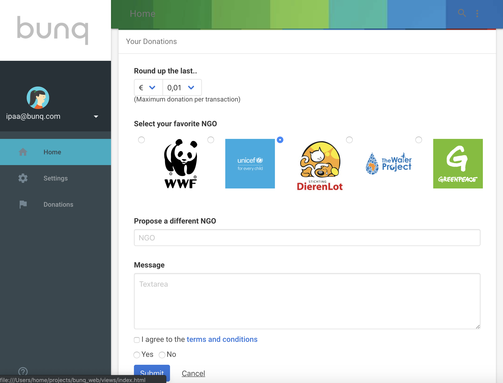
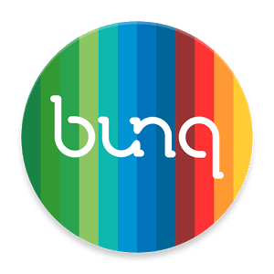

# bunqHackathon

Single-page JS app prototyte for setting up micro-donations to you favorites NGOs on you bunq account. This app was delivered after a 48hs hackaton in Amsterdam.

It is using Bulma Framework to get an awesome web interface.
